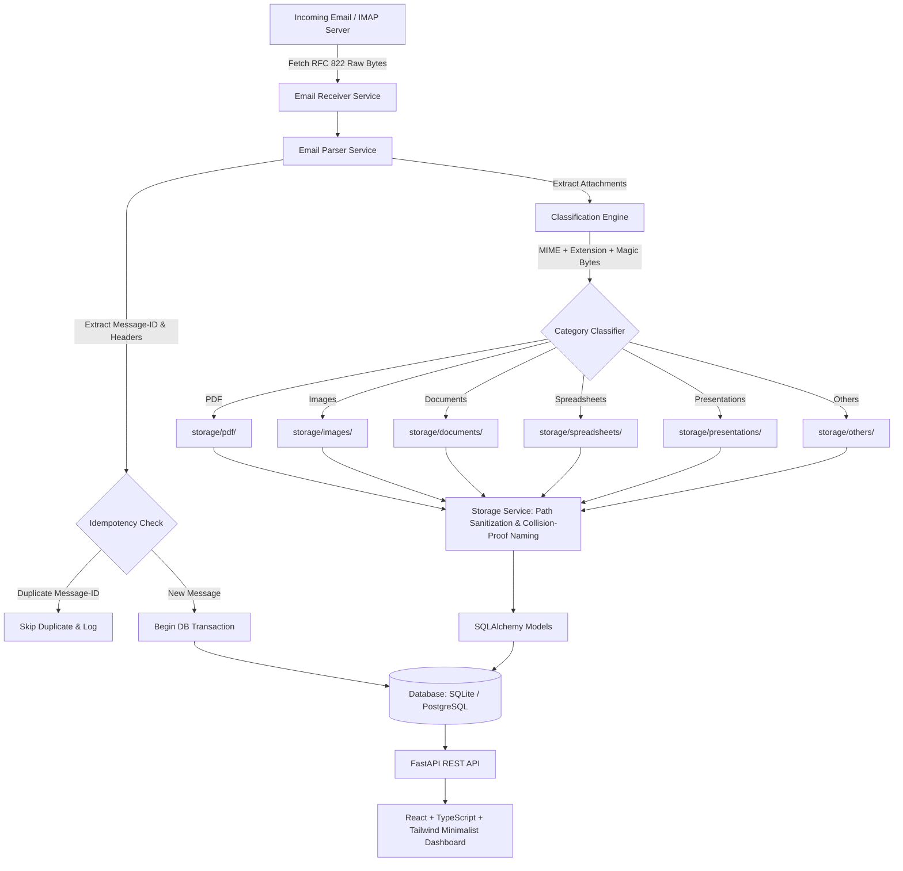

# FileFlow — Email Attachment Processing & File Management System

> A production-grade, modular Email Attachment Processing and File Management System featuring an automated IMAP receiver, robust MIME & binary classification, collision-resistant secure file storage, idempotent persistence, and a Linear/Vercel-inspired minimalist web dashboard with interactive file previews.

---

## Architecture Overview



---

## Features

- **Automated Mailbox Polling**: Connects over SSL/TLS to IMAP servers (Gmail, Outlook, custom IMAP) and retrieves unread emails with non-destructive fetching.
- **Strict Idempotency**: Guarantees zero duplicate processing by tracking unique RFC 822 `Message-ID` values with transaction rollback safety.
- **Multi-Layer Classification**: Validates attachments using binary magic bytes (`%PDF-`, `\x89PNG`, `PK\x03\x04`), MIME types, and file extensions.
  - **PDF**: `storage/pdf/`
  - **Images**: (`.png`, `.jpg`, `.jpeg`, `.webp`, `.svg`, `.gif`, `.bmp`) -> `storage/images/`
  - **Documents**: (`.docx`, `.doc`, `.txt`, `.rtf`, `.md`) -> `storage/documents/`
  - **Spreadsheets**: (`.xlsx`, `.xls`, `.csv`, `.tsv`) -> `storage/spreadsheets/`
  - **Presentations**: (`.pptx`, `.ppt`) -> `storage/presentations/`
  - **Others**: Unknown and generic binary files -> `storage/others/`
- **Security by Design**: Complete path traversal protection (`../` prevention), filename sanitization, file size limits, and sandboxed storage paths.
- **Collision-Resistant Naming**: `filename_YYYYMMDD_HHMMSS_uuid8.ext` avoids file-clobbering while preserving the original name in metadata.
- **Interactive File Previews**:
  - **PDF**: Embedded PDF viewer directly in the browser.
  - **Images**: Responsive image viewer with fit/zoom.
  - **Text / CSV**: Raw text viewer with monospace typography.
  - **Unsupported Types**: Clean informational card with one-click download.
- **Full Email Inspector**: View sender, recipient, received date, status, body (plain text & HTML), and direct links to attachments.
- **Live Interview Demonstration Engine**:
  - Built-in **"Simulate Email"** button in UI (`POST /api/process/simulate`).
  - Standalone CLI demo script: `python backend/scripts/simulate_email.py`.
  - Ingests realistic sample emails with real PDF, PNG, DOCX, and CSV attachments instantly without requiring live credentials!

---

## Technology Stack

### Backend
- **Python 3.12+**
- **FastAPI**: High-performance asynchronous REST API.
- **SQLAlchemy 2.0**: PostgreSQL-ready ORM with SQLite WAL mode default.
- **Pydantic v2**: Strict schema validation and settings management.
- **IMAPClient**: Robust IMAP protocol client.
- **Pathlib & Standard Library `email`**: Safe file paths & MIME parsing.

### Frontend
- **React 18** + **TypeScript**
- **Tailwind CSS**: Sleek dark/neutral theme (Linear / Vercel aesthetic).
- **Vite 5**: Fast development and production bundler.
- **Lucide Icons**: Professional minimalist iconography.

---

## Project Structure

```text
email-file-manager/
├── backend/
│   ├── app/
│   │   ├── main.py                     # FastAPI application factory
│   │   ├── api/
│   │   │   ├── emails.py               # Email listing & detail routes
│   │   │   ├── files.py                # File browser, download, preview routes
│   │   │   ├── dashboard.py            # Stats, storage metrics, live logs
│   │   │   └── process.py              # Sync trigger, scheduler, simulation
│   │   ├── core/
│   │   │   ├── config.py               # Pydantic Settings & environment
│   │   │   └── logging.py              # Structured logging (console + file)
│   │   ├── database/
│   │   │   ├── database.py             # Engine, sessionmaker, SQLite WAL
│   │   │   └── models.py               # Email & Attachment ORM models
│   │   ├── schemas/
│   │   │   ├── email.py                # Email schemas
│   │   │   ├── attachment.py           # Attachment schemas
│   │   │   └── dashboard.py            # Stats & result schemas
│   │   └── services/
│   │       ├── email_service.py        # IMAP connection & message fetch
│   │       ├── parser_service.py       # RFC 822 MIME parser & header decoder
│   │       ├── classification_service.py # Multi-layer MIME & magic byte classifier
│   │       ├── storage_service.py      # Path sanitization & safe storage
│   │       ├── processing_service.py   # Idempotent orchestrator
│   │       └── scheduler_service.py    # Background polling task runner
│   ├── storage/                        # Categorized attachment directories
│   │   ├── pdf/
│   │   ├── images/
│   │   ├── documents/
│   │   ├── spreadsheets/
│   │   ├── presentations/
│   │   └── others/
│   ├── logs/                           # Runtime log files (app.log)
│   ├── tests/                          # 22 comprehensive Pytest unit tests
│   ├── scripts/
│   │   └── simulate_email.py           # Standalone CLI demo script
│   ├── requirements.txt
│   └── .env.example
├── frontend/
│   ├── src/
│   │   ├── api/client.ts               # Typed REST API client
│   │   ├── components/
│   │   │   ├── layout/                 # Sidebar, Header
│   │   │   ├── files/                  # FilePreviewModal
│   │   │   └── emails/                 # EmailDetailDrawer
│   │   ├── pages/
│   │   │   ├── OverviewPage.tsx        # Dashboard overview & stats
│   │   │   ├── FilesPage.tsx           # Full file browser (search, filter, sort)
│   │   │   ├── EmailsPage.tsx          # Email history & reader
│   │   │   └── SettingsPage.tsx        # IMAP status, worker controls, logs
│   │   ├── types/index.ts              # TypeScript interfaces
│   │   ├── App.tsx                     # Main application shell
│   │   └── index.css                   # Minimalist design system
│   ├── package.json
│   ├── tailwind.config.js
│   └── vite.config.ts
├── docs/
│   └── ARCHITECTURE_ASSESSMENT.md      # Detailed 16-point technical document
├── Dockerfile
├── docker-compose.yml
└── README.md
```

---

## Quickstart Guide

### 1. Backend Setup

1. **Navigate to backend and create virtual environment**:
   ```bash
   cd backend
   python -m venv venv
   # On Windows:
   .\venv\Scripts\activate
   # On Linux/macOS:
   source venv/bin/activate
   ```

2. **Install dependencies**:
   ```bash
   python -m pip install -r requirements.txt
   ```

3. **Configure environment**:
   ```bash
   cp .env.example .env
   ```
   *(By default, `.env` uses local SQLite and is immediately ready for simulation and testing. To connect to live Gmail, set `EMAIL_USERNAME` and your 16-character Google App Password in `EMAIL_PASSWORD`)*.

4. **Run the backend server**:
   ```bash
   uvicorn backend.app.main:app --reload --port 8000
   ```
   - API Documentation (Swagger UI): `http://localhost:8000/docs`
   - Health Check: `http://localhost:8000/health`

---

### 2. Frontend Setup

1. **Navigate to frontend**:
   ```bash
   cd frontend
   ```

2. **Install dependencies and start development server**:
   ```bash
   npm install
   npm run dev
   ```
   - Dashboard will open at `http://localhost:5173`.

---

## Technical Interview Demonstration Workflow

To demonstrate the full end-to-end workflow in an interview:

```text
1. Start the application
          ↓
2. Open browser: http://localhost:5173
          ↓
3. Show clean dashboard overview (Linear/Vercel minimalist theme)
          ↓
4. Click "Simulate Email (Demo)" in sidebar or header
   (or run in terminal: python backend/scripts/simulate_email.py)
          ↓
5. Live Toast Notification appears:
   "Simulated email received and processed with 4 attachments!"
          ↓
6. Dashboard statistics immediately update:
   - Total Emails: +1
   - Total Files: +4
   - PDF: +1
   - Image: +1
   - Document: +1
   - Spreadsheet: +1
          ↓
7. Navigate to "All Files" or click category:
   - invoice.pdf appears under "PDFs"
   - photo.png appears under "Images"
   - report.docx appears under "Documents"
   - sales_data.csv appears under "Spreadsheets"
          ↓
8. Click any file to open interactive Preview:
   - PDF displays in embedded browser viewer
   - Image displays responsive preview
   - CSV displays monospace raw data
   - DOCX displays clean fallback card with Download button
          ↓
9. Click "Emails" in sidebar:
   - Click the received email to open the Email Detail Drawer
   - Inspect From, To, Subject, Received timestamp, and message body
   - Click any attachment chip to preview it directly
          ↓
10. Navigate to "Settings & Status":
   - Inspect live application logs showing structured audit trail:
     [INFO] Email parsed -> [INFO] Attachment classified -> [INFO] File stored safely
```

---

## Testing

Run the full pytest suite (22 unit & integration tests):
```bash
python -m pytest backend/tests/ -v
```

### Covered Test Areas:
- **Email Parsing**: Multipart bodies, boundary parsing, charset decoding.
- **RFC 2047 Decoding**: UTF-8 base64 encoded subjects (`=?UTF-8?B?...=`).
- **Attachment Extraction**: Decodes binary payload from MIME parts.
- **Classification Engine**: Validates PDF, PNG, JPEG, CSV, XLSX, DOCX, PPTX, and unknown scripts.
- **Security & Path Traversal**: Verifies path sanitization, stripping `../../`, and sandboxing in `STORAGE_PATH`.
- **Idempotency**: Submitting duplicate `Message-ID` verifies duplicate detection and zero double-processing.
- **REST APIs**: Tests `/health`, `/api/stats`, `/api/files`, `/api/emails`, `/api/process/simulate`, preview streaming, and download headers.

---

## Security Practices

1. **Directory Traversal Protection**: Uses regex character whitelisting and `pathlib.Path.resolve()` to ensure target paths never escape `storage/`.
2. **Deterministic Deduplication**: Prevents repeated ingestion of the same email even during concurrent polling runs.
3. **No Raw Filesystem Parameters**: API endpoints identify attachments solely via internal integer primary keys.
4. **Credential Isolation**: Credentials reside exclusively in environment variables and are never emitted in logs.
5. **Transactional Integrity**: Database rolls back and deletes orphaned files if an error occurs mid-process.

---

## Docker Deployment

To launch the full system with Docker Compose:
```bash
docker-compose up --build
```
- Backend will be available at `http://localhost:8000`
- Frontend will be available at `http://localhost:5173`

---

## Documentation

For an in-depth technical analysis covering all 16 interview assessment topics (architecture, processing flow, classification, scalability to S3/Postgres/Kafka, error handling, security, and future enhancements), refer to:
- [`docs/ARCHITECTURE_ASSESSMENT.md`](file:///c:/Users/amaln/OneDrive/Desktop/JOB/Email/docs/ARCHITECTURE_ASSESSMENT.md)
