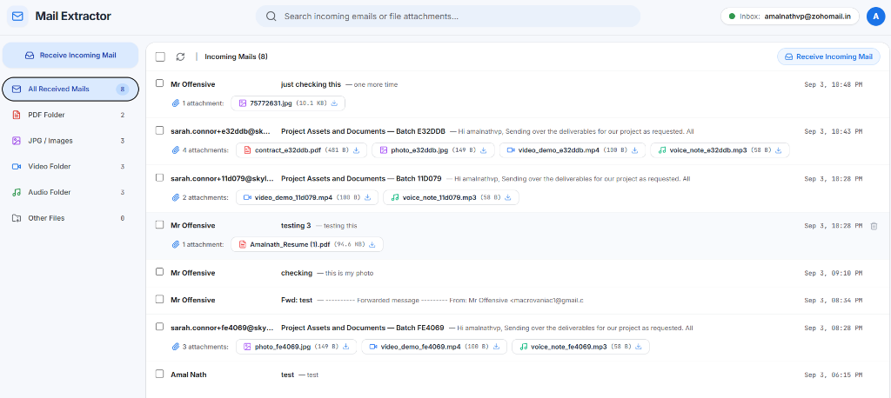
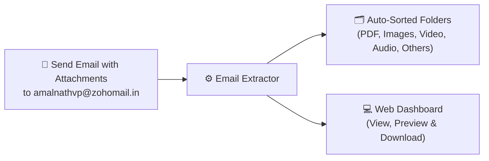

# Email Extractor

> Automatically extract and organize email attachments into dedicated folders (**PDF**, **Images**, **Video**, **Audio**, and **Others**) with a clean, mobile-friendly web dashboard.

---

## What is Email Extractor?

**Email Extractor** automatically monitors an email inbox, downloads incoming attachments, and organizes them into neat, categorized folders so you never have to manually sort files again.

### How It Works

It's as simple as this:

1. **Send an email** with attachments to:  
   👉 **`amalnathvp@zohomail.in`** *(or your own configured email address)*.
2. **Email Extractor automatically categorizes** each attachment into its dedicated folder:
   - 📄 **PDF** (`storage/pdf/`): `.pdf` documents
   - 🖼️ **Images** (`storage/jpg/`): `.jpg`, `.png`, `.webp`, `.gif`
   - 🎥 **Video** (`storage/video/`): `.mp4`, `.mov`, `.avi`, `.mkv`
   - 🎵 **Audio** (`storage/audio/`): `.mp3`, `.wav`, `.aac`, `.m4a`
   - 📦 **Others** (`storage/others/`): `.zip`, documents, spreadsheets, etc.
3. **View everything in the Web Dashboard**:
   - See all incoming emails and their attachments.
   - Preview files directly in your browser (PDFs, pictures, videos, audio player).
   - Download any file with one click.
   - Instant search and instant email deletion.

---

## Dashboard Preview



*The dashboard features categorized folder navigation (PDF, Images, Video, Audio, Others), instant search, inline file preview modals, and full mobile responsiveness.*

---

## Simple Flow



---

## Default Email & How to Change It

> [!NOTE]
> The default email configured in this project is **`amalnathvp@zohomail.in`**.  
> You can easily change this to your own email address (Zoho, Gmail, Outlook, etc.).

### Steps to Use Your Own Email:

1. Open `backend/.env` and update your mail credentials:

```env
TARGET_EMAIL="your-email@example.com"
EMAIL_HOST="imap.zoho.in"          # e.g., imap.zoho.in, imap.gmail.com, outlook.office365.com
EMAIL_PORT=993
EMAIL_USERNAME="your-email@example.com"
EMAIL_PASSWORD="your-app-password" # App Password from your email provider
EMAIL_USE_SSL=true
EMAIL_FOLDER="INBOX"
```

2. *(Optional)* Update `VITE_EMAIL_ADDRESS` in `frontend/.env` to display your email on the dashboard header.

> **Tip for Gmail & Zoho users**: Use an **App Password** (not your regular account password) generated from your email provider's security settings.

---

## How to Run the Project

### Prerequisites
- **Python 3.10+**
- **Node.js 18+**

---

### 1. Start the Backend

```bash
# Go to backend folder
cd backend

# Create & activate virtual environment
python -m venv venv
venv\Scripts\activate    # On Windows
# source venv/bin/activate # On Linux/macOS

# Install dependencies
pip install -r requirements.txt

# Start backend server
uvicorn backend.app.main:app --reload --port 8000
```
The backend API will run at `http://localhost:8000`.

---

### 2. Start the Frontend

```bash
# In a new terminal, go to frontend folder
cd frontend

# Install dependencies
npm install

# Start frontend dev server
npm run dev
```
Open your browser at **`http://localhost:5173`**.

---

## How to Use It

1. **Send Mail**: Send an email with attachments to **`amalnathvp@zohomail.in`**.
2. **Sync**: Click the **Sync / Refresh** button in the dashboard to fetch new emails immediately.
3. **Browse Folders**: Click **PDF**, **Images**, **Video**, **Audio**, or **Others** in the sidebar or mobile menu to see your auto-sorted files.
4. **Preview & Download**: Click any attachment to preview it directly in your browser or click **Download**.
5. **Delete**: Click the trash button to delete emails instantly.

---

## Project Structure

```
Email/
├── assets/                     # Dashboard preview images
├── backend/                    # FastAPI backend
│   ├── app/
│   │   ├── api/                # API endpoints (emails, files, process)
│   │   ├── database/           # Database models & Supabase connection
│   │   └── services/           # IMAP email receiver, parser & classifier
│   ├── storage/                # Auto-sorted local folders (pdf, jpg, video, audio, others)
│   └── requirements.txt        # Backend dependencies
├── frontend/                   # React + TypeScript + Tailwind frontend
│   ├── src/
│   │   ├── components/         # File cards & preview modal
│   │   └── App.tsx             # Main dashboard UI
│   └── package.json            # Frontend dependencies
└── README.md                   # Documentation
```

---

## License

MIT License.
