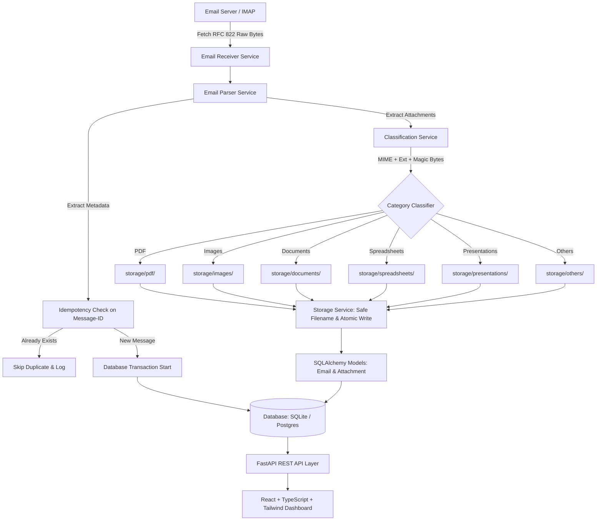
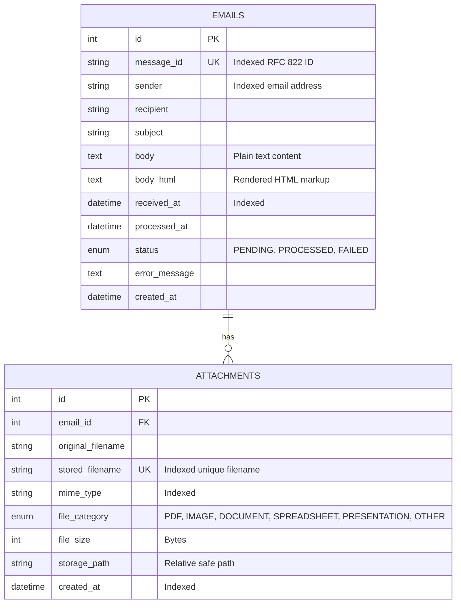
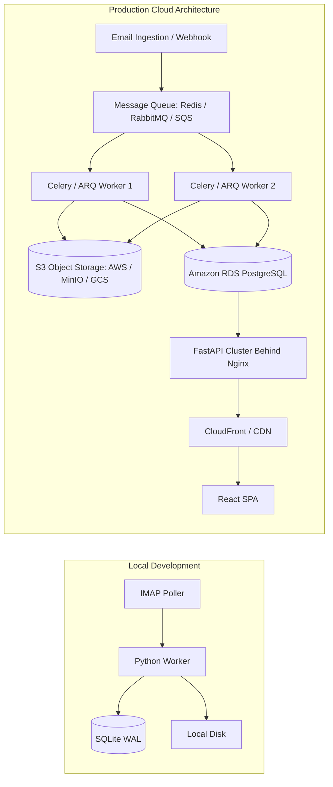

# FileFlow — Email Attachment Processing & File Management System
## Technical Architecture & Assessment Documentation

---

### 1. Problem Statement
Modern enterprises and professionals receive hundreds of daily emails containing mission-critical documents: billing invoices (PDF), signed contracts, identity photos (PNG/JPG), spreadsheet reports (XLSX/CSV), and presentation slide decks. Manually triaging inboxes, extracting file attachments, renaming them to avoid file-clobbering, organizing them into directory hierarchies, and ensuring no duplicates are ingested is tedious, error-prone, and inefficient. 

**FileFlow** solves this by delivering an automated, secure, idempotent email attachment extraction and categorization engine paired with a modern, high-performance web dashboard.

---

### 2. Objectives
1. **Automated Inbox Retrieval**: Connect securely via IMAP (with SSL/TLS) to any email provider (Gmail, Outlook, self-hosted IMAP).
2. **Deterministic Idempotency**: Never process or store duplicate attachments when scanning the same mailbox repeatedly.
3. **Multi-Layer Classification**: Accurately categorize files into designated folders (PDF, Images, Documents, Spreadsheets, Presentations, Others) without blindly trusting file extensions.
4. **Resilient & Collision-Proof Storage**: Prevent directory traversal attacks, sanitize filenames, and prevent name collisions using timestamped UUID tokens.
5. **Zero-Friction Interview Demonstration**: Provide full live IMAP support while offering a built-in simulation engine and standalone script to demonstrate end-to-end processing without requiring live credentials.
6. **Minimalist, High-Performance Dashboard**: Deliver a Linear/Vercel-inspired UI with instant file previews (embedded PDF, responsive images, text preview) and search/filtering.

---

### 3. Requirements Summary
- **Backend**: Python 3.12+, FastAPI, SQLAlchemy ORM, Pydantic v2, IMAPClient, pathlib.
- **Frontend**: React 18, TypeScript, Tailwind CSS, Vite, Lucide icons.
- **Database**: SQLite (WAL mode) for zero-config local development, with standard SQLAlchemy dialect abstractions for PostgreSQL production readiness.
- **Supported File Types**:
  - **PDF**: `.pdf` -> `storage/pdf/`
  - **Images**: `.jpg`, `.jpeg`, `.png`, `.gif`, `.webp`, `.bmp`, `.svg` -> `storage/images/`
  - **Documents**: `.doc`, `.docx`, `.txt`, `.rtf`, `.md` -> `storage/documents/`
  - **Spreadsheets**: `.xls`, `.xlsx`, `.csv`, `.tsv` -> `storage/spreadsheets/`
  - **Presentations**: `.ppt`, `.pptx` -> `storage/presentations/`
  - **Others**: Unrecognized or generic binaries -> `storage/others/`

---

### 4. System Architecture



---

### 5. Detailed Processing Flow

1. **Trigger Phase**: Processing is triggered either **manually** via `POST /api/process`, **periodically** via the background asyncio poller, or via the **simulation engine** `POST /api/process/simulate`.
2. **Mailbox Connection**: `EmailService` connects over SSL (port 993) to the IMAP server, authenticates, and selects the configured folder (default `INBOX`).
3. **Search & Fetch**: Performs an IMAP search (e.g. `UNSEEN`). For matching message UIDs, fetches the raw RFC 822 message payload using non-destructive peek flags.
4. **Header & Body Parsing**:
   - Decodes RFC 2047 encoded subject and sender headers (e.g., UTF-8 base64 or quoted-printable).
   - Extracts sender, recipient, subject, and timezone-aware date.
   - Extracts plain text and HTML bodies.
   - Generates or normalizes the RFC 822 `Message-ID`.
5. **Idempotency Verification**: Queries the database for `emails.message_id == parsed.message_id`. If found, skips further processing and records a duplicate skip in the audit log.
6. **Attachment Processing**:
   - Traverses MIME parts (`msg.walk()`).
   - Identifies parts marked with `Content-Disposition: attachment` or having filenames.
   - Inspects binary content magic bytes (e.g., `%PDF-`, `\x89PNG`, `PK\x03\x04`).
   - Resolves target category and directory.
   - Sanitizes filename against directory traversal (`..`, slashes, null bytes).
   - Generates collision-resistant name: `<safe_base>_<YYYYMMDD_HHMMSS>_<uuid8>.<ext>`.
   - Writes file atomically to the category directory.
7. **Database Transaction**:
   - Inserts `Email` record with status `PENDING`.
   - Inserts child `Attachment` records with foreign key relationship.
   - Updates `Email` record to `PROCESSED` with timestamp.
   - Commits transaction. If any failure occurs, rolls back DB changes and unlinks any stored files written during the transaction.
8. **IMAP Flag Update**: If configured, marks the email as `\Seen` on the server.

---

### 6. Email Parsing
- **MIME Multipart Handling**: Recursively walks multipart/mixed, multipart/alternative, and multipart/related MIME trees.
- **RFC 2047 Header Decoding**: Uses `email.header.decode_header` to convert encoded words like `=?UTF-8?B?...=` into clean Python Unicode strings.
- **Charset Normalization**: Inspects `part.get_content_charset()` to correctly decode text bodies across UTF-8, Latin-1, Windows-1252, and ASCII.
- **Missing Message-ID Fallback**: If an email client emits an email without a `Message-ID` header, a deterministic fallback is computed using `SHA-256(sender + subject + received_at)`.

---

### 7. Attachment Classification
FileFlow utilizes a **3-tier multi-layer classification engine**:

| Layer | Method | Responsibility |
| :--- | :--- | :--- |
| **Layer 1** | Binary Magic Bytes | Reads first 512 bytes of raw content (`%PDF-`, `\x89PNG`, `\xff\xd8\xff`, `GIF87a`, `PK\x03\x04`, `BM`, `RIFF/WEBP`, `<svg`). |
| **Layer 2** | Normalized MIME Type | Inspects declared Content-Type header, stripping parameters and normalizing aliases. |
| **Layer 3** | Extension Mapping | Inspects sanitized file extension using an explicit mapping table. |

**Conflict Resolution**: Magic byte verification overrides declared MIME types and extensions. If an executable is disguised as `invoice.pdf`, the absence of `%PDF-` and detection of binary signatures flags it for the `OTHERS` category.

---

### 8. File Storage Strategy
- **Path Sandboxing**: Target paths are resolved using `pathlib.Path.resolve()`. The target must reside within `STORAGE_PATH`; any path containing directory traversal attempts (`..`, absolute drive letters, null bytes) triggers a `StorageSecurityError`.
- **Collision Resistance**: 
  - Original file: `invoice.pdf`
  - Stored file: `invoice_20260902_123045_a81f3c2e.pdf`
  - Database preserves both `original_filename` (for presentation & download) and `stored_filename` / `storage_path` (for physical retrieval).
- **Size Limitation**: File sizes are validated against `MAX_FILE_SIZE_BYTES` (default 50 MB) before disk writes to protect against zip bombs or denial-of-service storage exhaustion.

---

### 9. Database Design



---

### 10. REST API Design

| Method | Endpoint | Description |
| :--- | :--- | :--- |
| `GET` | `/health` | Service health and storage availability status |
| `GET` | `/api/stats` | Dashboard statistics, category counts, storage usage, worker state |
| `GET` | `/api/logs` | Real-time structured application log lines |
| `GET` | `/api/files` | Paginated file browser with search, category, sort (`name`, `date`, `size`) |
| `GET` | `/api/files/{id}` | Single file metadata with associated email details |
| `GET` | `/api/files/{id}/preview` | Streams file inline with matching Content-Type (PDF, Image, Text) |
| `GET` | `/api/files/{id}/download` | Streams file with `Content-Disposition: attachment` |
| `DELETE` | `/api/files/{id}` | Deletes physical file and removes attachment database record |
| `GET` | `/api/emails` | Paginated email listing with status filter and attachment counts |
| `GET` | `/api/emails/{id}` | Detailed email view with body and attachment list |
| `POST` | `/api/process` | Manually triggers IMAP mailbox intake |
| `POST` | `/api/process/simulate` | Generates realistic mock email with 4 categorized attachments |
| `GET` | `/api/process/status` | Poller worker state, interval, last run time |
| `POST` | `/api/process/scheduler/start` | Starts background polling task |
| `POST` | `/api/process/scheduler/stop` | Stops background polling task |
| `POST` | `/api/process/upload-eml` | Ingests custom `.eml` file directly |

---

### 11. Web Dashboard (Linear / Vercel Minimalist)
- **Neutral Palette**: Tailored dark theme using slate/zinc tones (`#09090b` canvas, `#121215` cards, subtle borders `#27272a`).
- **Sidebar**: Quick navigation between Overview, All Files, Emails, Settings, with dynamic category badges and an instant "Simulate Email" button.
- **Embedded Previews**:
  - **PDF**: Full browser PDF rendering inside an embedded sandbox iframe.
  - **Images**: Responsive centered preview supporting PNG, JPG, GIF, WebP, SVG.
  - **Text / CSV**: Monospace formatted raw text viewer with smooth scrolling.
  - **Unsupported Types**: Elegant fallback card detailing file metadata with a direct 1-click download button.

---

### 12. Error Handling & Resilience
- **Transactional Rollback**: Database records and physical files are committed in tandem. If disk writing or categorization throws an exception, all files created during that transaction are unlinked, preventing orphaned filesystem artifacts.
- **Fault-Tolerant Parsing**: Corrupted attachments or unreadable headers do not crash the daemon. Failed emails are recorded with `status = FAILED` and `error_message` stored for debugging.
- **Structured Logging**: Log messages follow a unified format:
  ```text
  2026-09-02 12:00:00 [INFO] [email_manager] - Email parsed Message-ID: '<...>'
  2026-09-02 12:00:00 [INFO] [email_manager] - Classified attachment 'report.docx' -> Category: DOCUMENT
  2026-09-02 12:00:00 [INFO] [email_manager] - File stored safely: 'documents/report_...docx' (51 bytes)
  ```

---

### 13. Security Considerations
1. **Directory Traversal Defense**: All input filenames are sanitized; target paths are checked using `STORAGE_PATH in resolved_path.parents`.
2. **Credential Sanitization**: Passwords and secrets are read strictly from environment variables (`.env`). Application logs never print passwords or authorization tokens.
3. **No Arbitrary Filesystem Access**: File download and preview endpoints resolve files strictly via internal database IDs and storage keys, never allowing users to supply raw disk paths.
4. **Denial of Service Limits**: `MAX_FILE_SIZE_BYTES` guards against oversized attachments; pagination limits max items per page to 100.

---

### 14. Scalability: Evolution to Distributed Architecture



To evolve FileFlow into an enterprise-scale distributed deployment:
1. **Object Storage**: Swap `StorageService` for an S3-compatible backend (AWS S3, MinIO, or Cloudflare R2). Stored paths become S3 object keys; preview and download endpoints generate secure Presigned S3 URLs.
2. **Task Queue**: Decouple ingestion from processing using Celery or ARQ with Redis/RabbitMQ. Email fetches push raw payloads to a message queue, allowing worker pools to scale horizontally.
3. **Database**: Switch `DATABASE_URL` to PostgreSQL on AWS RDS or Supabase. The SQLAlchemy models already use standard types compatible with PostgreSQL.
4. **Push Ingestion**: Complement IMAP polling with webhook push notifications (e.g., SendGrid Inbound Parse, AWS SES, or Gmail Push Pub/Sub).

---

### 15. Testing Strategy
- **22 Comprehensive Unit & Integration Tests**:
  - `test_parser.py`: RFC 2047 decoding (`=?UTF-8?B?...=`), multipart walking, fallback Message-ID hash generation.
  - `test_classification.py`: Multi-layer classification for PDF, PNG, JPG, CSV, XLSX, DOCX, PPTX, and unknown scripts.
  - `test_storage.py`: Path traversal attack strings (`../../etc/passwd`), duplicate generation, safe write, and size enforcement.
  - `test_idempotency.py`: Re-submitting identical Message-IDs verifies deduplication.
  - `test_api.py`: FastAPI endpoints testing `/health`, `/api/stats`, `/api/process/simulate`, `/api/files`, preview streaming, and download headers.

---

### 16. Future Enhancements
1. **Optical Character Recognition (OCR)**: Integrate Tesseract or AWS Textract to extract text from scanned PDF invoices and image screenshots.
2. **AI Categorization & Extraction**: Use LLMs to extract structured invoice line items (Vendor Name, Total Amount, Due Date, Tax ID) into dedicated metadata columns.
3. **Multi-User RBAC**: Add JWT authentication and organization-level workspaces.
4. **Full-Text Document Search**: Index extracted body text and document text with PostgreSQL pg_trgm or Meilisearch.
